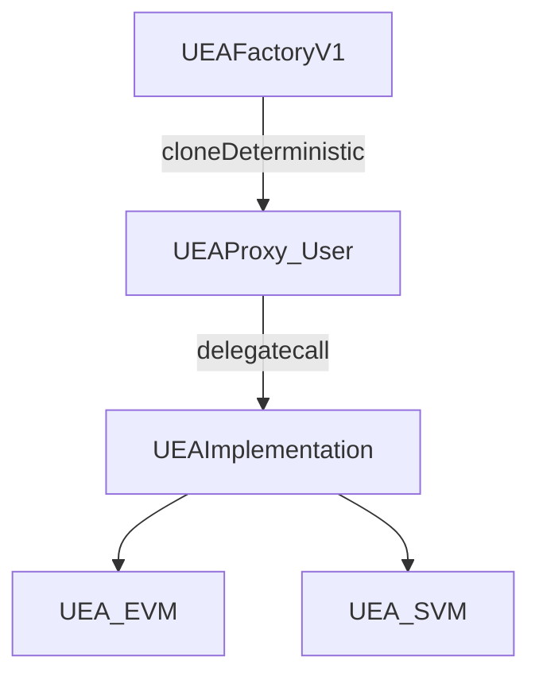
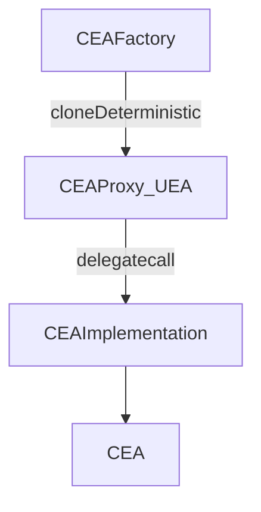

# Push Chain Core Contracts

This repository contains the core smart contracts powering Push Chain’s universal interoperability protocol. The system enables users and applications across chains to interact with Push Chain through a set of deterministic accounts, protocol coordinators, and token primitives.

## Architecture Overview

At a high level, the protocol is composed of:

- **Universal Executor Accounts (UEAs)**: smart accounts on Push Chain representing external-chain users.
- **Chain Executor Accounts (CEAs)**: smart accounts on external chains that execute on behalf of a UEA in a vault-driven model.
- **UniversalCore**: protocol coordinator contract on Push Chain, operated by the Universal Executor Module.
- **PRC20**: synthetic token primitive representing assets from external chains.
- **WPC**: wrapped native PC token used as an ERC-20 compatible primitive.

## Getting Started

### Prerequisites

- [Foundry](https://book.getfoundry.sh/getting-started/installation)
- Git
- Solidity 0.8.26

### Setup

```bash
git submodule update --init --recursive
forge build
```

Example deployment:

```bash
forge script scripts/deployFactory.s.sol --rpc-url <RPC_URL> --private-key <PRIVATE_KEY> --broadcast
```

## Repository Structure

```
push-chain-core-contracts/
├── src/
│   ├── UEA/
│   │   ├── UEA_EVM.sol
│   │   ├── UEA_SVM.sol
│   │   ├── UEAFactoryV1.sol
│   │   ├── UEAProxy.sol
│   │   └── UEAMigration.sol
│   ├── CEA/
│   │   ├── CEA.sol
│   │   ├── CEAFactory.sol
│   │   └── CEAProxy.sol
│   ├── UniversalCore.sol
│   ├── PRC20.sol
│   ├── WPC.sol
│   ├── Interfaces/
│   │   ├── IUEA.sol
│   │   ├── IUEAFactory.sol
│   │   ├── ICEA.sol
│   │   ├── ICEAFactory.sol
│   │   ├── ICEAProxy.sol
│   │   ├── IUniversalCore.sol
│   │   ├── IUniversalGateway.sol
│   │   ├── IPRC20.sol
│   │   ├── IWPC.sol
│   │   └── IUniswapV3.sol
│   ├── libraries/
│   │   ├── Types.sol
│   │   ├── Errors.sol
│   │   └── Utils.sol
│   └── mocks/
├── scripts/
└── test/
```

## Core Contract 1: Universal Executor Accounts (UEAs)

UEAs are smart accounts deployed on Push Chain that represent users from external chains. A UEA verifies execution authorization using the user’s native signing scheme and then executes calls on Push Chain.

### UEA Implementations

Two implementation variants are provided to support different external signing schemes:

| Implementation | Intended external VM | Signature verification |
|---|---|---|
| `UEA_EVM` | EVM chains | ECDSA (secp256k1) |
| `UEA_SVM` | Solana | Ed25519 (via verifier precompile) |

### UEAFactoryV1

`UEAFactoryV1` is responsible for deploying UEAs deterministically and managing the mapping between an external user identity and their UEA on Push Chain. It deploys per-user proxies (clones) and points them to the correct UEA implementation for the user’s VM type.

### UEA Proxy Architecture

UEAs use a minimal proxy pattern: each user gets a dedicated `UEAProxy` (storage lives in the proxy), while logic is shared via a UEA implementation.



## Core Contract 2: Chain Executor Accounts (CEAs)

CEAs are smart accounts deployed on external chains. A CEA represents a specific UEA (on Push Chain) on a specific external chain and is driven by an external-chain Vault / gateway flow (no end-user signatures and no direct user interaction model in v1).

### CEAFactory

`CEAFactory` deploys CEAs deterministically as minimal proxies and maintains a mapping between:
- **UEA on Push Chain** ↔ **CEA on the external chain**

It also tracks the proxy template and the shared CEA logic implementation used for new deployments.

### CEA Proxy Architecture

Each deployed CEA is a `CEAProxy` clone that delegates to a shared `CEA` implementation. All account state is stored in the proxy via delegatecall.



## CEA vs UEA (Quick Differences)

| Aspect | UEA | CEA |
|--------|-----|-----|
| **Deployment location** | Push Chain | External chain |
| **Control model** | User-authenticated (via native signatures) | Vault-driven (no user signatures in v1) |
| **Identity** | Represents an external-chain user | Represents a specific UEA on a specific external chain |
| **Execution scope** | Executes on Push Chain | Executes on external chain using balances held on that chain |

## UniversalCore (Protocol Coordinator)

`UniversalCore` is the protocol coordinator contract on Push Chain. It is primarily operated by the Universal Executor Module and provides the core coordination layer that interacts with token primitives and chain configuration needed for interoperability flows.

## Token Primitives: PRC20 and WPC

- **PRC20**: Push Chain synthetic token representing assets from external chains. These tokens are minted/burned as part of protocol flows and integrate with the core protocol contracts.
- **WPC**: wrapped native PC token, used as an ERC-20 compatible primitive (e.g., for integrations that expect ERC-20 behavior).

## Migration (UEA + CEA)

### UEA migration

UEAs are deployed via `UEAProxy` and can be migrated to newer implementation logic using the `UEAMigration` pattern (delegatecall-based migration invoked through the proxy). `UEAFactoryV1` maintains the current `UEA_MIGRATION_CONTRACT` used for migrations.

### CEA migration

CEAs are deployed as `CEAProxy` clones that are initialized once with a CEA logic implementation. `CEAFactory` can update template addresses for **new deployments**, while already-deployed CEAs keep their configured implementation (any change for existing CEAs would require an explicit redeploy/move strategy at the protocol level).

## License

This project is licensed under the MIT License.

## Additional Resources

- [Push Protocol Documentation](https://docs.push.org)

---
